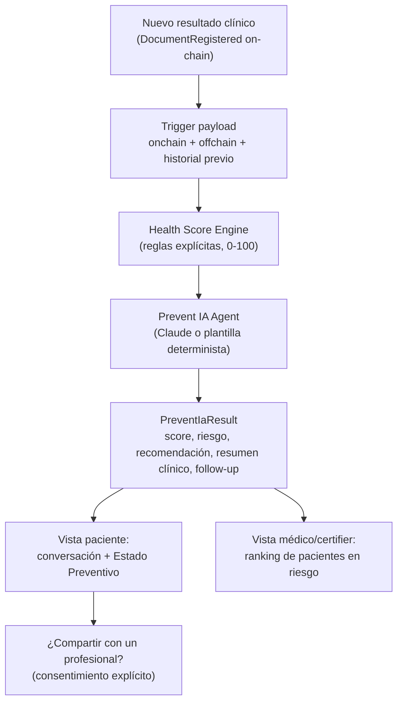

# Prevent IA — Resumen de arquitectura y código

> Documento de referencia para iterar el pitch deck. Resume qué es Prevent IA,
> cómo está construido hoy dentro de HealthProof, qué es real vs. mock, y qué
> mensajes de producto/arquitectura son defendibles frente a un jurado técnico.

---

## 1. Qué es, en una frase

**Prevent IA es un agente de prevención clínica que vive dentro de HealthProof:
detecta cambios de riesgo en los resultados clínicos de un paciente en el
momento en que se registran on-chain, calcula un Health Score explicable (no
una caja negra), y conversa con el paciente para entregarle una recomendación
preventiva y, si corresponde, ofrecerle compartirla con un profesional.**

No es un dashboard de reportes: es una capa de inteligencia que se activa
sobre la infraestructura de verificación que HealthProof ya tiene (documentos
médicos, permisos, redes de salud), reutilizando sus mismos rieles de
autenticación, cifrado y diseño.

---

## 2. Dónde vive dentro de HealthProof

HealthProof (rama `feature/prevent-ia-integration`, base `prevent_ia`) ya
resuelve tres problemas antes de que exista Prevent IA:

1. **Verificación on-chain de documentos médicos** — `MedicalDocumentRegistry`
   (Avalanche, `infra/avalanche/contracts`) registra cada documento
   (`patient`, `issuer`, `institution`, `documentType`, `clinicalHash`,
   `episodeId`, `cid`, `standard`, `classification`, `createdAt`) y emite un
   evento `DocumentRegistered`.
2. **Control de acceso soberano del paciente** — `PermissionManager` decide
   quién puede leer qué documento y por cuánto tiempo.
3. **Contenido clínico cifrado cliente-side** — el valor clínico real (ej.
   "LDL 170 mg/dL") nunca llega en claro a un servidor; viaja cifrado
   (Supabase/IPFS + `document_secrets`).

Prevent IA se construye **sobre** esos tres pilares, no en paralelo a ellos:
el tipo `OnChainMedicalDocument` (`services/prevent-ia/types.ts`) replica
campo a campo el struct real de `MedicalDocumentRegistry.sol`, así que
conectar el trigger real a futuro es un *port*, no un rediseño.

Prevent IA también sigue el mismo patrón de resiliencia que la integración
FHIR-RAG ya existente en el repo (`services/fhir-rag/openai-client.ts`):
**si el proveedor de IA no está disponible, cae a una plantilla determinista
en vez de romper la demo o el producto.**

---

## 3. El flujo completo (evento → agente → decisión)

Paso a paso:

1. **Trigger** — hoy simulado (`ClinicalTriggerPayload`: `onchain` +
   `offchain` + `historialPrevio`), con la forma exacta que tendría un
   documento real. *(Ver §6 — Limitaciones.)*
2. **Health Score Engine** (`health-score-engine.ts`) — reglas 100%
   explicables: compara el valor contra un rango de referencia clínico
   reconocido y contra el historial del mismo paciente, y resta puntos con
   una razón trazable para cada penalización. **Nunca es un modelo de caja
   negra.**
3. **Prevent IA Agent** (`agent.ts`) — con el Health Score ya calculado (no
   lo recalcula ni lo contradice), redacta en lenguaje humano la
   recomendación al paciente y el resumen técnico para el médico. Usa Claude
   (`@anthropic-ai/sdk`) si hay `ANTHROPIC_API_KEY`; si no, usa una plantilla
   determinista equivalente.
4. **Salida (`PreventIaResult`)** — `healthScore`, `riskLevel`,
   `scoreExplanation`, `patientRecommendation`, `clinicalSummary`, `followUp`,
   `historyMissing`. Esta única estructura alimenta *todas* las vistas.
5. **Distribución por audiencia** — la misma data se presenta distinto según
   quién mira:
   - **Paciente**: conversación guiada (saludo → preguntas de contexto →
     "calculando" → Estado Preventivo → recomendaciones → ¿compartir?).
   - **Médico / certifier**: ranking 0-100 de sus pacientes, priorizado por
     riesgo, para triage rápido.
6. **Consentimiento y compartir** — el paciente decide explícitamente si
   comparte el análisis con un profesional (CESFAM, hospital, clínica o
   médico) — nunca es automático.

---

## 4. Componentes de código (mapa de archivos)

Todo vive bajo `apps/frontend/healthproof-frontend/src/**/prevent-ia/`,
siguiendo la misma separación en capas que el resto de HealthProof
(`services` → `actions` → `hooks` → `components`).

### 4.1 Dominio y reglas (`services/prevent-ia/`)

| Archivo | Responsabilidad |
|---|---|
| `types.ts` | Tipos del dominio: `OnChainMedicalDocument` (mirror 1:1 del struct Solidity), `ClinicalResult`, `PatientHistoryEntry`, `RiskLevel`, `ClinicalTriggerPayload`, `FollowUp`, `PreventIaResult`. |
| `reference-ranges.ts` | Rangos de referencia clínicos por código **LOINC**, con umbrales reales y reconocidos (ADA para glicemia, NCEP ATP III para LDL). Hoy hardcodeado; diseñado para ser reemplazado por `retrieveContextForCategories()` de FHIR-RAG (`services/fhir-rag/embed.ts`) cuando haya credenciales productivas. |
| `health-score-engine.ts` | El motor de reglas: `calculateHealthScore()` (score 0-100 + explicación trazable) y `buildScoreTimeline()` (serie histórica de scores, un punto por EMPA/control, para la comparación longitudinal). |
| `agent.ts` | `runPreventIaAgent()`: redacta `patientRecommendation` y `clinicalSummary` a partir del score ya calculado. Claude con fallback a plantilla determinista. Decide `followUp` (seguimiento sugerido) solo cuando el patrón clínico lo amerita, nunca por defecto. |
| `patients.ts` | `getRankedPatients()`: corre el mismo motor + agente sobre la "base" mock de pacientes para construir el ranking de riesgo (vista médico). |
| `mock/*.json` | Datos 100% ficticios con la forma exacta de los tipos reales — permiten ejercitar el mismo código que se usaría con datos reales, sin depender de un documento real ya descifrado. |

### 4.2 Server actions (`actions/prevent-ia/`)

| Archivo | Responsabilidad |
|---|---|
| `analyze-document.ts` | `analyzeDocument()` — corre el ciclo completo (engine + agente) sobre un escenario mock; expone `AnalyzeDocumentResponse` (incluye `scoreTimeline`). Envuelto en `withAuth` (autenticación Privy + rate limiting: 20 req/min). |
| `get-patient-ranking.ts` | `getPatientRanking()` — expone el ranking de pacientes. También detrás de `withAuth`; el filtrado por rol (solo doctor/certifier ven esta vista) se aplica en la página, no en la acción. |

### 4.3 Hooks cliente (`hooks/prevent-ia/`)

| Archivo | Responsabilidad |
|---|---|
| `usePreventIaAnalysis.ts` | Fetch + cache (`sessionStorage`, TTL 5 min) + cooldown de errores (30s) para el análisis de un escenario — mismo patrón que `useDashboardStats`. |
| `usePatientRanking.ts` | Igual patrón, condicionado a `enabled` (solo se activa si el rol on-chain del usuario es doctor/certifier). |

### 4.4 Componentes de UI (`components/prevent-ia/`)

Todos siguen el sistema de diseño neumórfico existente de HealthProof
(`neu-shell`, `neu-surface`, `neu-inset`, `neu-pressed`, `neu-chip`,
variables `--hp-*`) — no se introdujo ningún token visual nuevo.

| Componente | Qué muestra |
|---|---|
| `ScoreGauge.tsx` | Gauge circular SVG animado (0-100) + badge de nivel de riesgo. |
| `PatientPanel.tsx` | Recomendación en lenguaje simple para el paciente + seguimiento sugerido, si aplica. |
| `ClinicalSummaryPanel.tsx` | Resumen técnico para el médico: examen, valor, rango de referencia, historial. |
| `LongitudinalComparisonChart.tsx` | Línea de tiempo del Health Score, un punto por EMPA (control), resaltando el EMPA recién registrado — responde a "¿esto viene mejorando o empeorando?". |
| `ScenarioSwitcher.tsx` | Selector de escenario mock (riesgo bajo / en ascenso / alto) para la demo. |
| `PatientRankingTable.tsx` | Tabla de pacientes ordenada 0-100 por riesgo (vista médico/certifier). |
| `DemoDataBanner.tsx` | Disclaimer de datos ficticios (transparencia obligatoria mientras el trigger sea mock). |
| `risk-styles.ts` | Paleta de riesgo compartida (clases Tailwind + hex para SVG) — una sola fuente de verdad visual para bajo/moderado/alto. |

### 4.5 Integración en el resto de la app

- **Navegación**: entrada "Prevent IA" (ícono `HeartPulse`) en el sidebar y
  el menú móvil, visible para roles `patient` y `doctor`
  (`lib/navigation.ts`).
- **i18n**: `messages/es.json` / `messages/en.json`, namespace
  `dashboard.preventIa.*` — toda la copy vive en next-intl, no hardcodeada.
- **Ruta**: `app/[locale]/dashboard/prevent-ia/page.tsx` — una sola página,
  sin módulos nuevos.

---

## 5. Por qué esto es defendible frente a un jurado (ángulos de pitch)

1. **Explicable, no una caja negra.** Cada punto que resta el Health Score
   tiene una razón legible (`scoreExplanation`): banda clínica + tendencia
   vs. historial. Un médico puede auditar el número, no solo confiar en él.
2. **La IA generativa nunca decide el riesgo — solo lo comunica.** El score
   y el nivel de riesgo salen *siempre* del motor de reglas; Claude (o la
   plantilla) redacta el mensaje humano a partir de un resultado ya
   calculado, nunca al revés. Esto evita el riesgo regulatorio de "una IA
   diagnosticando".
3. **Resiliente por diseño.** Sin `ANTHROPIC_API_KEY`, el producto sigue
   funcionando igual (plantilla determinista) — no depende de que un
   proveedor externo esté arriba para dar valor.
4. **Reutiliza la confianza que HealthProof ya construyó.** Mismo esquema de
   auth (`withAuth`, Privy), mismo rate limiting, mismo modelo de datos
   on-chain, mismo sistema de diseño. Prevent IA no es un producto aparte:
   es una capa de inteligencia sobre la infraestructura de verificación.
5. **Doble audiencia con una sola fuente de verdad.** El mismo
   `PreventIaResult` alimenta tanto la conversación 1:1 con el paciente como
   el ranking de triage del médico — no hay dos sistemas de scoring.
6. **Longitudinal, no solo puntual.** `buildScoreTimeline()` reconstruye la
   serie histórica EMPA a EMPA, permitiendo mostrar tendencia real de
   riesgo en el tiempo, no solo una fotografía del último examen.
7. **El paciente mantiene control soberano.** Compartir el análisis con un
   profesional siempre pasa por un consentimiento explícito — consistente
   con el modelo de permisos on-chain del resto de HealthProof.

---

## 6. Qué es real y qué es mock hoy (honestidad para el roadmap slide)

| Pieza | Estado |
|---|---|
| Motor de Health Score (reglas, penalizaciones, explicación) | **Real** — lógica de producto ejecutándose sobre datos con forma real. |
| Agente Prevent IA (Claude + fallback) | **Real** — llamada real a Anthropic si hay API key; fallback determinista real. |
| Rangos de referencia clínicos (LOINC) | **Reales pero hardcodeados** (ADA / NCEP ATP III) — el reemplazo planeado es la integración FHIR-RAG ya existente en el repo. |
| Estructura de datos on-chain (`OnChainMedicalDocument`) | **Espejo exacto** del struct real de `MedicalDocumentRegistry.sol`. |
| **Trigger** (evento → análisis) | **Mock.** Corre sobre 3 escenarios ficticios (`mock-clinical-results.json`), no sobre `DocumentRegistered` real, porque el contenido clínico se cifra en el cliente y hoy ningún servidor puede leerlo en claro para analizarlo. |
| Base de pacientes para el ranking | **Mock** (`patients-db.json`, 10 pacientes ficticios inspirados en distribución agregada DEIS/MINSAL — ninguna ficha real). |
| Compartir con un profesional (CESFAM/hospital/clínica/médico) | **Simulado en la UI** — no ejecuta todavía una concesión de permiso real vía `PermissionManager`. |

**Próximo paso técnico más importante:** decidir dónde corre el análisis
real (¿en el cliente, justo después del descifrado? ¿con una identidad propia
de Prevent IA dada de alta como *grantee* en `PermissionManager`?) para
conectar el trigger real sin romper el modelo de cifrado cliente-side.

---

## 7. La experiencia de usuario: de "dashboard" a "agente"

La primera versión de la UI mostraba el análisis como un dashboard
(gráficos, tarjetas y tablas visibles todas a la vez). La dirección de
producto actual es que Prevent IA **se sienta como un agente que acompaña**,
no como una pantalla más:

- El paciente no ve primero un número o una tabla; el agente le habla
  primero ("Hola, revisé tus resultados…"), pide contexto con preguntas
  puntuales (consentimiento de edad, tabaquismo, antecedentes familiares), y
  solo después revela el Estado Preventivo con una animación de "cálculo".
- Las recomendaciones se presentan como acciones concretas, no como texto
  técnico.
- El detalle clínico (rangos, historial, comparación longitudinal) queda
  disponible pero oculto por defecto — "para tu médico", no para la
  primera lectura del paciente.
- El cierre natural de la conversación es la pregunta de compartir el
  análisis con un profesional, reforzando que el paciente decide.

Esta capa narrativa reordena **la misma data y los mismos componentes**
descritos en la sección 4 — no reemplaza el motor de reglas ni el agente, y
no introduce módulos nuevos; solo cambia cuándo y cómo se revela cada pieza
de información.

---

## 8. Glosario rápido para el deck

- **EMPA**: control/examen preventivo del paciente (cada punto de la serie
  longitudinal es un EMPA).
- **Health Score**: número 0-100, más alto = mejor salud preventiva.
- **Risk Level**: `bajo` / `moderado` / `alto`, derivado directamente del
  Health Score (≥85 bajo, ≥60 moderado, <60 alto).
- **Follow-up**: seguimiento sugerido (ej. "control en 3 meses"), solo
  cuando el patrón de riesgo lo amerita — nunca por defecto.
- **Trigger**: el evento que despierta a Prevent IA (hoy simulado; a futuro,
  `DocumentRegistered` on-chain).
